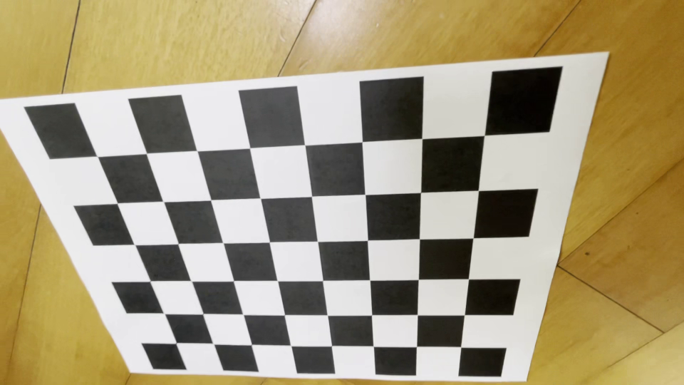
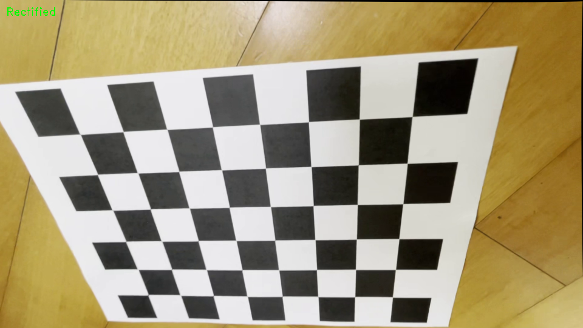

# 📷 Lens Distortion Removal

이 프로젝트는 OpenCV를 활용하여 **카메라 캘리브레이션(Camera Calibration)** 및 **렌즈 왜곡 보정(Lens Distortion Correction)** 을 수행합니다.  
체스보드 패턴이 포함된 영상을 기반으로 카메라의 내부 파라미터를 추정하고, 이를 활용하여 기하학적 왜곡을 제거한 보정 영상을 생성합니다.

---

## 🔧 주요 기능

- 체스보드 영상 기반 카메라 캘리브레이션
- 카메라 내부 행렬(K), 왜곡 계수 추정
- 렌즈 왜곡 보정 (실시간 프레임 보정)
- 보정 전/후 영상 비교 (Tab 키 전환)
- 보정 전/후 사진 캡쳐 (s 키)
- 보정된 영상 저장 (`.avi`)
---

## 🧪 캘리브레이션 결과

- The number of selected images = 9
- RMS reprojection error = 1.410557
- Camera matrix (K) =
[[911.06897706   0.         959.39682216]
 [  0.         912.93482348 536.39064935]
 [  0.           0.           1.        ]]
- Distortion coefficients = [-0.0104789   0.01314287 -0.00267109  0.00416095 -0.00936107]
---

## original_frame
 

## rectified_frame
 
